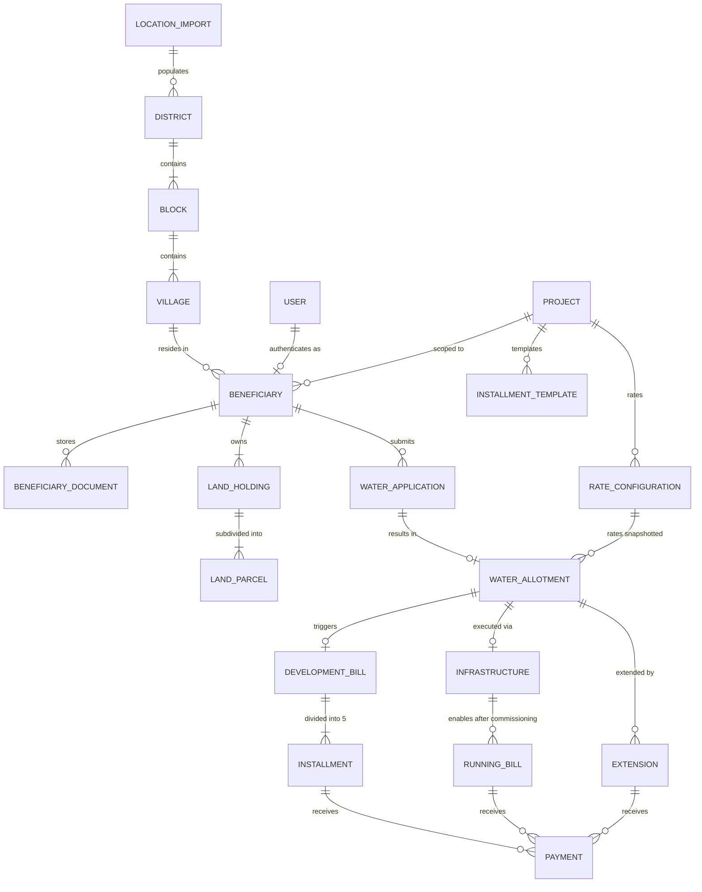

# Water Management System — V1 Architecture Specification

## 1. Chosen Technology Stack

| Layer | Technology | Purpose & Rationale |
| :--- | :--- | :--- |
| **Frontend** | Next.js 14+ (App Router), TypeScript, Tailwind CSS, shadcn/ui components, React Hook Form, Zod, TanStack Query | Type-safe, modular UI with server/client components, deterministic form validation, and reactive data fetching. |
| **Backend** | NestJS, TypeScript, REST API, OpenAPI/Swagger | Enterprise-grade modular architecture with strict dependency injection, DTO validation pipes, and automated OpenAPI documentation. |
| **Database & ORM** | PostgreSQL 16, Prisma ORM | Relational integrity, ACID transactions, exact `NUMERIC` precision for financial & volumetric calculations, and schema migrations. |
| **Caching / Queue**| Redis 7 (via Docker Compose) | Token blacklisting, session support, and ready for background task processing. |
| **Authentication** | Passport.js, JWT (Access + Refresh tokens), bcrypt | Stateless bearer authentication with role-based guard middleware; decoupled from identity provider for future OIDC/OAuth2 expansion. |
| **Infrastructure** | Docker & Docker Compose | Containerized local development reproducing identical production runtime (Postgres, Redis, Backend, Frontend). |

---

## 2. Module Structure (Modular Monolith)

The NestJS backend is organized into domain-specific modules with strict encapsulation:

```
src/modules/
├── auth/            # JWT issuance, refresh tokens, passport strategies, AuthGuard
├── users/           # User accounts and profile management
├── roles/           # RBAC permissions (ADMIN, FIELD_OFFICER, ACCOUNTS, VIEWER, BENEFICIARY)
├── projects/        # Water management schemes lifecycle & metadata
├── locations/       # Official LGD hierarchy (District -> Block -> Village) & Excel Import engine
├── beneficiaries/   # Beneficiary records, phone lookup workflow, permanent UUIDs
├── beneficiary-portal/ # Farmer self-service portal, 5-stage onboarding, quota requests
├── land/            # Land holdings & SF/subdivision parcels with strict area checksums
├── rates/           # Versioned volumetric & development rate configurations
├── water/           # Water applications & approvals with rate/land snapshots
├── billing/         # Development bills, 5-installment schedules, running bills
├── payments/        # Immutable payment ledger, receipt generation, modes & reversals
├── infrastructure/  # Project physical execution lifecycle (Planned -> Commissioned)
├── extensions/      # Land/water extension requests without mutating root allotments
├── audit/           # PostgreSQL-backed immutable audit log capturing JSONB diffs
├── dashboard/       # Aggregated KPIs, metrics, and pending workflow queues
└── common/          # Decimal arithmetic utils, decorators, filters, interceptors
```

Each module provides its own `Controller`, `Service`, `DTOs` (with `class-validator`), and exposes only necessary services to other modules.

---

## 3. Database Relationships & Entity Hierarchy



---

## 4. History & Versioning Strategy

To guarantee absolute traceability and audit compliance:
1. **Never Overwrite Rate Configurations**:
   - `rate_configurations` records are append-only with `effective_from` and `effective_to` timestamps.
   - When a rate change occurs, the prior record has its `effective_to` closed, and a new record is created.
2. **Immutable Financial & Quantity Snapshots**:
   - `water_allotments` stores `total_land_acres_snapshot`, `litres_per_acre_snapshot`, `rate_id`, and `calculated_allotted_litres` alongside `approved_litres`.
   - `development_bills` snapshots `approved_litres_snapshot`, `development_cost_per_litre_snapshot`, and total cost.
   - Later changes to a beneficiary's land or project rates never retroactively alter historical allotments or billing.
3. **5-Installment Schedule Snapshots**:
   - Installment schedule templates require Installment 1 (default 2.5%) + Installments 2–5 to sum to 100.00%.
   - Every development bill generates its own immutable set of 5 installment records reflecting the active schedule at the moment of approval.
4. **Immutable Payment Ledger**:
   - Payments are append-only. Errors are corrected via reversal records (`is_reversal: true`, referencing the original payment), preserving full paper trails.
5. **PostgreSQL-Backed Audit Log**:
   - `audit_logs` captures `action`, `entity_type`, `entity_id`, `old_values` (JSONB), `new_values` (JSONB), `reason`, `ip_address`, and `user_id`.

---

## 5. Authentication & Authorization Strategy

1. **Authentication**:
   - Stateless JWT: Access Token (15m expiry) + Refresh Token (7d expiry, stored in DB/Redis with revocation).
   - Password hashing using bcrypt (cost factor 12).
   - Architecture interfaces `AuthService` so SAML/OIDC/OAuth2 identity providers can plug in transparently.
2. **Role-Based Access Control (RBAC)**:
   - **`ADMIN`**: Unrestricted access, application approvals, rate versioning, installment schedule templates, commissioning overrides.
   - **`FIELD_OFFICER`**: Phone lookup, beneficiary onboarding, land holding and parcel registration, water application submissions.
   - **`ACCOUNTS`**: Billing view, payment collection, financial reconciliation, receipt verification.
   - **`VIEWER`**: Strict read-only access across all domains.
   - **`BENEFICIARY`**: Dedicated self-service portal. Strictly isolated to records where `beneficiary_id === req.user.beneficiary_id`. Beneficiaries can register holdings with parcel checksums, view formula previews, submit water applications, monitor 5-stage installments, download receipts, view infrastructure status, request supplemental extensions, upload documents, and review their audit history. They have ZERO administrative authority to approve applications, alter rates, commission infrastructure, or mutate bills.
   - Enforced via NestJS `@Roles(...)` metadata decorator and `RolesGuard` at the controller and route level.
3. **Strict Multi-Tenant Ownership Security Model**:
   - Beneficiary endpoints (`/api/v1/beneficiary/*`) resolve identity directly from the authenticated token.
   - Cross-beneficiary queries are rejected with `404 Not Found` or `403 Forbidden`. Beneficiary A cannot read or write Beneficiary B's parcels, applications, bills, installments, payments, receipts, or history.

---

## 6. Major Business Rules

1. **Beneficiary Identification**:
   - Phone number is an indexed lookup key, not the PK. Beneficiary PK is an immutable UUID (`beneficiary_id`).
   - Phone search workflow prevents duplicate beneficiary creation when additional land holdings or water applications are registered.
2. **Land Parcel Validation**:
   - \(\sum \text{parcel areas} == \text{declared\_total\_area}\) for every land holding.
   - Enforced on submission; mismatches block submission.
3. **Total Land Calculation**:
   - Total Beneficiary Land is dynamically computed from active land holdings/parcels across the beneficiary and cannot be arbitrarily overwritten.
4. **Three Water Quantity Concepts**:
   - **Required Litres**: Farmer's stated request (input).
   - **Calculated Allotted Litres**: \(\text{Total Beneficiary Land (acres)} \times \text{Litres Per Acre Snapshot}\).
   - **Approved Litres**: Explicitly determined and entered by an `ADMIN`.
5. **Atomic Transactional Approval**:
   - Approving a water application executes in a single PostgreSQL transaction: verifies state -> snapshots rate -> creates allotment -> generates development bill -> generates 5 installment records -> writes audit log -> commits.
6. **Infrastructure Gate for Running Charges**:
   - Infrastructure status lifecycle: `PLANNED` \(\to\) `UNDER_CONSTRUCTION` \(\to\) `COMPLETED` \(\to\) `COMMISSIONED`.
   - Running bills cannot be generated until status is `COMMISSIONED`.
7. **Extension Isolation**:
   - Extension requests are distinct entities referencing the original allotment. Approving an extension creates distinct extension billing without mutating the original allotment.
8. **Decimal Precision**:
   - All financial and quantity fields use PostgreSQL `NUMERIC` types and backend `decimal.js` to eliminate IEEE-754 floating point inaccuracies.
